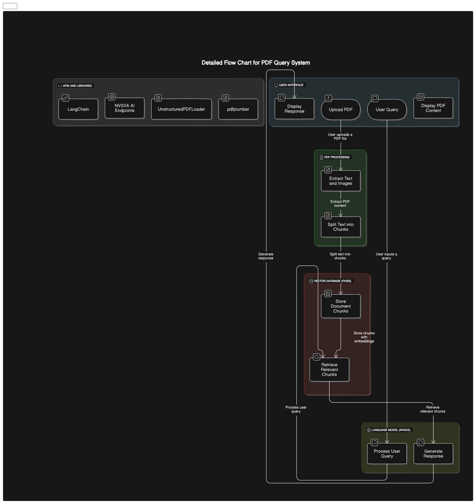

# 🧠 OneByZero RAG using NVIDIA

Streamlit application for PDF-based Retrieval-Augmented Generation (RAG) using Nvidia + LangChain. The app uses `meta / 
llama3-70b-instruct` model and `FAISS` as vector database under the hood.

This application allows users to upload a PDF, process it, and then ask questions about the content using a selected language model.

## Features

- **Upload PDF**: Upload a PDF file.
- **View Documents**: View the uploaded document as images.
- **Zoom Level**: Adjust the zoom level of the document preview.
- **Delete Collection**: Delete the current collection of uploaded documents.
- **Question Processing**: Ask questions about the content of the PDFs using a selected language model.
- **Session State**: Retains the context and previously uploaded documents for the session.


## Hardware Requirements
- **CPU:** Quad-core processor
- **RAM:** Minimum 8GB
- **Storage:** At least 10GB of free space
- **GPU:** NVIDIA GPU with CUDA support (recommended for better performance)

## Software Requirements
- **Operating System:** Windows 10 or later / macOS 10.15 or later / Linux
- **Python Version:** Python 3.8 or later
- **Libraries:** Listed below in the setup section

## Installation

1. **Clone the Repository**

   ```bash
   git clone <repository-url>
   cd <repository-directory>

2. **Create a virtual environment**

    ```bash
    python -m venv env
    source env/bin/activate  
     # On Windows, use `env\\Scripts\\activate`

3. **Install dependencies**

    ```bash
    pip install -r requirements.txt

4. **Set up environment variables**

    Create a .env file in the project root directory and add the following:

    ```bash
    NVIDIA_API_KEY="NVIDIA_API_KEY"

5. Run the application

    ```bash
    streamlit run app.py


## Architecture


